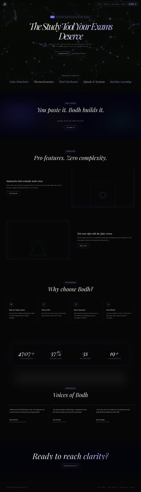
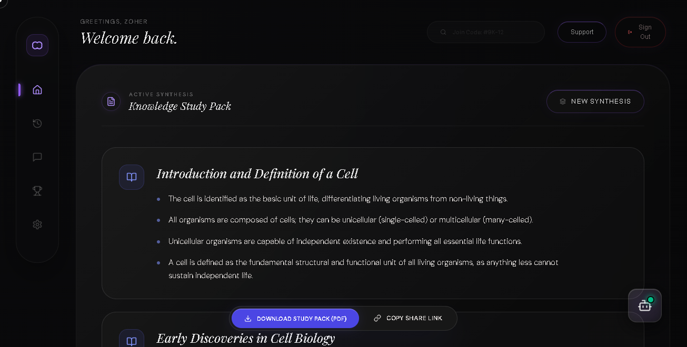

# Bodh - AI Study Platform

Bodh is an advanced AI-powered study platform designed for high-speed academic synthesis. It provides students with a suite of tools including AI tutors, high-compression study pack sharing, and engaging learning formats like the Duel Arena. It is built with a premium glass-metal UI for a refined user experience.

## ✨ Features

- **AI Tutor & Academic Synthesis**: Contextual AI tutor designed to aid in fast and effective learning.
- **Dynamic Study Packs**: Generate and consume rich study materials with a high-compression sharing system natively built-in.
- **Duel Arena**: An interactive competitive environment where users can test their knowledge against others.
- **Premium User Interface**: A meticulously crafted glass-metal responsive UI using Next.js and Tailwind CSS.
- **Google Authentication**: Seamless and secure sign-in experience.
- **Persistent Storage**: MongoDB integration for reliable user profiles, study packs, and chat history.

## 📸 Screenshots

*(Replace the placeholder links with your actual screenshot files)*


*Landing Page*


*Bodh Dashboard & AI Tutor*


*Duel Arena Interface*

## 🛠️ Technology Stack

- **Frontend**: Next.js 14, React, Tailwind CSS, Google OAuth, PDF/Text processing utilities.
- **Backend**: Node.js, Express, TypeScript, MongoDB (Mongoose), JSON Web Tokens (JWT).
- **Core Integrations**: OpenAI & Google Generative AI for the AI Tutor and synthetic data generation.

## 🚀 Setup & Installation

Follow these steps to get Bodh running locally on your machine. The project is split into a frontend and a backend workspace.

### Prerequisites

- [Node.js](https://nodejs.org/) (v18 or higher recommended)
- [MongoDB](https://www.mongodb.com/) (Local instance or MongoDB Atlas cluster)
- Required API Keys/Secrets (Google Client ID, OpenAI API Key, Google Generative AI API Key, etc.)

### 1. Backend Setup

1. Open a terminal and navigate to the backend directory:
   ```bash
   cd backend
   ```
2. Install dependencies:
   ```bash
   npm install
   ```
3. Set up your environment variables. Ensure the `.env` file in the `backend` directory contains the necessary keys (e.g., `PORT`, `MONGODB_URI`, `JWT_SECRET`, API keys).
4. Start the backend development server:
   ```bash
   npm run dev
   ```

### 2. Frontend Setup

1. Open a new terminal and navigate to the frontend directory:
   ```bash
   cd frontend
   ```
2. Install dependencies:
   ```bash
   npm install
   ```
3. Set up your environment variables. Ensure the `.env` file in the `frontend` directory contains the necessary keys (e.g., `NEXT_PUBLIC_GOOGLE_CLIENT_ID`, API keys, backend URL if needed).
4. Start the frontend development server:
   ```bash
   npm run dev
   ```

### 3. Usage

Once both servers are running:
- Open your browser and navigate to `http://localhost:3000` (default Next.js port) to view the application.
- The backend API will be listening on its configured port (e.g., `http://localhost:5000`).
- Log in using Google Authentication to start using Bodh!

## 📜 License

[Add your license information here]
